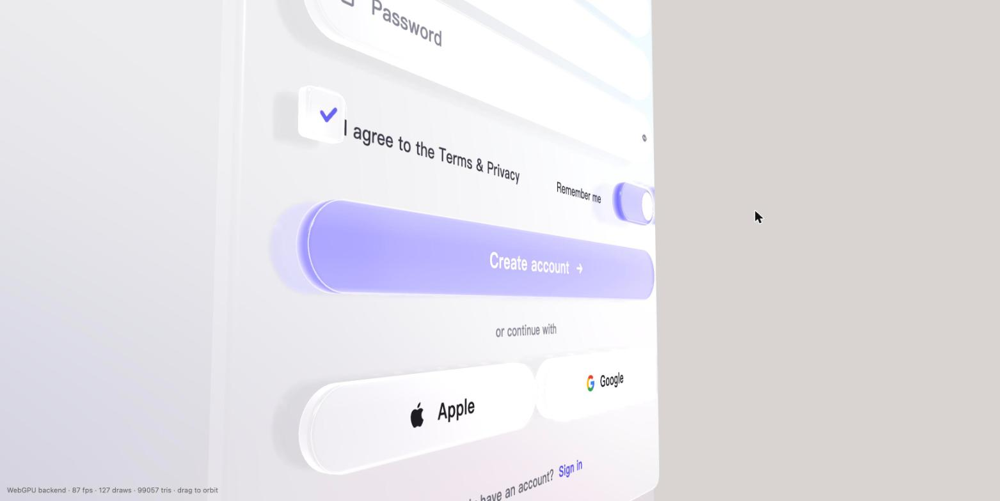
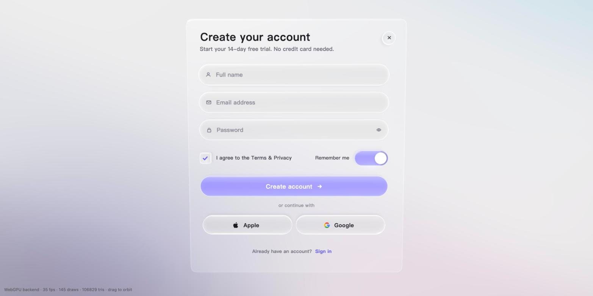

# ThreeDUI

**一套 three.js 的 3D UI 组件库：渲染和交互全部在 canvas 内完成，视觉按苹果 Liquid Glass，用 Vue 语法编写，面向 AI coding agent 设计。**

[English](./README.md) · [在线 Demo](https://fortbrain.ai/concepts/glassui-signup/) · [为什么要做它（博客）](https://fortbrain.ai/blogs/glassui-liquid-glass/) · [设计文档](./docs/superpowers/specs/2026-10-07-glassui-core-design.md)



上图全部是 three.js 几何体：输入框和按钮是有厚度的透明玻璃块，主按钮的颜色从玻璃**内部**发出来，影子投在面板上，面板倒映着控件。没有一个 DOM 元素。在线 Demo 里拖动一下就能看到厚度。

## 为什么

1. **写 UI 的主体变成了 AI。** 复杂度由 coding agent 承担，所以 API 可以做得显式、强大，而不必简短——只要文档对 agent 足够清楚。
2. **表现力。** DOM 只能在平面上*模拟*厚度、光影和材质；在 3D 引擎里它们是真的，而且和场景里其它东西共享同一套光。
3. **GPU 越来越强。** three.js 的 `WebGPURenderer` 在 WebGPU 不可用时自动回落 WebGL2，今天的手机就能跑。
4. **跨平台。** 画在 canvas 里的东西，在浏览器、Electron、Tauri、webview 和 XR 头显里长得一样、交互一样。

## 它是什么

- **Vue 3 语法**（`.vue` 单文件组件、`v-if`/`v-for`/插槽/事件），通过自定义 Vue 渲染器实现；底层内核与框架无关。
- **容器（`Surface`）活在 3D 里**：可以用位置/旋转/缩放放进任意场景，也可以钉在面向相机的屏幕层——同一套代码。
- **默认 Liquid Glass**：真实的倒角玻璃几何、透射项采样 backdrop 的 PBR 节点材质、原生彩色透射阴影、平面反射，控件采用"发光层 + 玻璃壳 + 装饰层"三层结构。
- **覆盖 Tailwind 的组件集**：按钮、输入框、复选框、开关、标签页、对话框、菜单、表格……每个元素都支持 `tw="…"` 工具类字符串。
- **中文显示与输入法输入是一等公民**：按需生成的字形 atlas + 系统字体回退，输入法代理定位到光标处。
- **为 agent 而设计**：严格的强类型 props；每个错误都列出允许值和最接近的候选；每个组件附带机器可读的 manifest。

## 状态

早期，公开开发中。渲染方案已经通过一系列 spike 验证（见 `spikes/` 与 `docs/superpowers/spikes/`），在线 Demo 就是当前 spike 的构建。实现按 `docs/superpowers/plans/` 里的计划推进：

| 计划 | 范围 | 状态 |
|---|---|---|
| 1 — 基础 | monorepo、`@glassui/core`（节点树、样式/主题/tw、Yoga 布局、事件、焦点、滚动、弹簧、渲染列表）、`@glassui/text`（支持中文换行的系统字体引擎） | 进行中 |
| 2 — 渲染 | `@glassui/render`：three.js WebGPU/TSL 玻璃、面板、文字、阴影、Surface、质量分级 | 计划中 |
| 3 — Vue 与组件 | Vue 自定义渲染器、第一批组件、IME 桥、manifest | 计划中 |




## 试一试

```bash
pnpm install
pnpm playground         # http://127.0.0.1:5176 ，基于 @glassui/core + @glassui/render 的注册表单和世界层场景
```

查询参数：`?scene=signup|world|both`（默认 `both`）、`?quality=high|medium|low|minimal`（默认自适应）、`?webgl` 强制 WebGL2 后端。拖动背景可环绕观察（表单固定在屏幕上，世界层面板随场景移动）。HUD 显示后端、帧率、UI draw call 数、质量档位和 Surface 数。`pnpm playground:build` 把静态构建输出到 `examples/playground/dist`。

原来的 spike 仍保留作对比：

```bash
pnpm spike:glass3d      # http://127.0.0.1:5174 ，加 ?webgl 强制 WebGL2 后端
```

## 仓库结构

```
docs/superpowers/specs/   设计文档（所有决策的依据）
docs/superpowers/plans/   实现计划，每个子系统一份
docs/superpowers/spikes/  每个 spike 的发现与推理
spikes/glass3d/           当前 Demo：真 3D 的 Liquid Glass 注册表单
spikes/glass/             第一版（被否掉的）平面 SDF 方案，留作对比
packages/                 @glassui/core、@glassui/text、@glassui/render……（由各计划逐步填入）
examples/playground/      基于这些包搭的注册表单和世界层场景（`pnpm playground`）
```

## 玻璃是怎么做的（一段话）

每个控件是一块拉伸出厚度的超椭圆：竖直侧壁，顶边和底边各有一圈小圆角。材质是 three.js 的 `MeshPhysicalNodeMaterial`，用它的 `backdropNode` 钩子把 diffuse 项替换成"透过玻璃看到的像"（用真实法线做 Snell 折射、穿过真实厚度、三通道不同 IOR 做色散），高光、Fresnel、薄膜干涉和环境反射都由引擎提供。有颜色的控件不是吸收色，而是从玻璃内部*发光*，按 Fresnel 加权所以边缘更亮。阴影是方差阴影贴图并开启 `shadowMap.transmitted`，彩色玻璃投出彩色影子。光栅化做不出来的那几样"晶莹"特征——轮廓亮线、底边亮带、下方的光晕——作为薄薄的装饰层叠在几何上。完整的推理过程（包括走过的弯路）见上面的博客。

## 许可证

Apache-2.0，见 [LICENSE](./LICENSE)。
